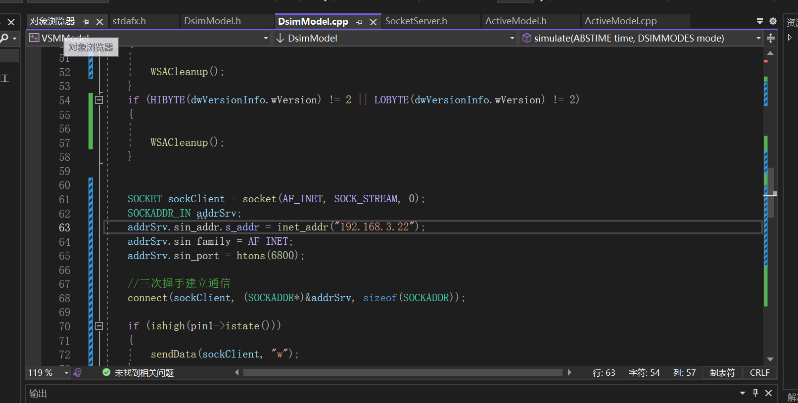
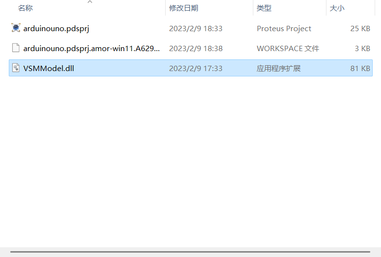
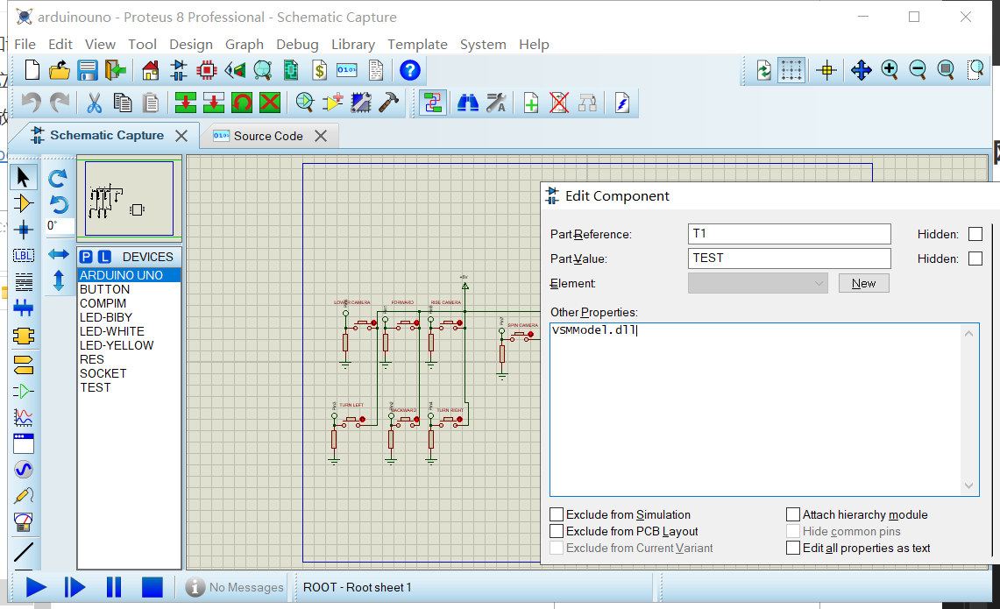

# VSMModel-TCP
Proteus中创建自定义元件，调用dll文件实现tcp-client，向指定ip地址发送数据

## 开发环境

- windows11

- proteus  8.15

- visual studio 2022 community 

  > 默认安装即可，理论上不需要安装额外组件

## 关于VSM

- [Proteus VSM 仿真模型](https://github.com/MockbaTheBorg/VSMModel)

  > 在使用Proteus仿真单片机系统的过程中，经常找不到所需的元件，这就需要自己编写。Proteus  VSM的一个主要特色是使用基于DLL组件模型的可扩展性。这些模型分为两类：电气模型（Electrical  Model）和绘图模型（Graphical  Model）。电气模型实现元件的电气特性，按规定的时序接收数据和输出数据；绘图模型实现仿真时与用户的交互，例如LCD的显示。一个元件可以只实现电气模型，也可以都实现电气和绘图模型。
  >
  > Proteus为VSM模型提供了一些C++抽象类接口，用户创建元件时需要在DLL中实现相应的抽象类。

  - [PROTEUS的元器件及模型制作](http://www.dwenzhao.cn/profession/proteus/proteus2.html)
  - [Creation VSM](https://d1.amobbs.com/bbs_upload782111/files_11/ourdev_572204.PDF)
  - [Proteus 自建元件库](https://d1.amobbs.com/bbs_upload782111/files_9/ourdev_240204.pdf)
  - [Program interface VSM SDK](https://d1.amobbs.com/bbs_upload782111/files_11/ourdev_572203.PDF)
  - [Proteus VSM SDK](http://101.42.165.240:5243/share/w23UwR6V)
  - [Proteus VSM SDK 英文版的中文翻译件](https://d1.amobbs.com/bbs_upload782111/files_30/ourdev_565287EB4NPW.pdf)

## DLL

- TCP协议的基本知识

  - 三次握手 建立连接

  - 四次挥手 释放连接

  - [针对TCP的Socket编程](https://xiaolincoding.com/network/3_tcp/tcp_interview.html#socket-%E7%BC%96%E7%A8%8B)

- 想改ip直接看`DismModel.cpp`

  

## 如何操作

1. 打开dll工程，选择x86，编译生成dll文件，放到proteus工程同级目录下

2. 准备好`VSMModel.dll`后，打开`arduinouno.pdsprj`，运行仿真

   

## 其他参考资料

https://github.com/MockbaTheBorg/VSMModel
